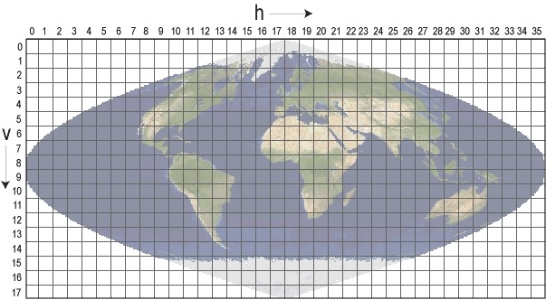

# `modland` Python Package


The `modland` Python package generates georeferencing information for [MODIS/VIIRS Sinusoidal tiles](https://modis-land.gsfc.nasa.gov/MODLAND_grid.html).

The Julia equivalent for this package is [MODLAND.jl](https://github.com/STARS-Data-Fusion/MODLAND.jl).

[Gregory H. Halverson](https://github.com/gregory-halverson-jpl) (they/them)<br>
[gregory.h.halverson@jpl.nasa.gov](mailto:gregory.h.halverson@jpl.nasa.gov)<br>
NASA Jet Propulsion Laboratory 329G



## Environment

```
mamba create -y -n modland -c conda-forge python=3.11 jupyter pykdtree 
mamba activate modland
```

## Installation

This package is available on PyPi as a [pip package](https://pypi.org/project/modland/).

```bash
pip install modland
```

## Usage

```python
import modland
```
